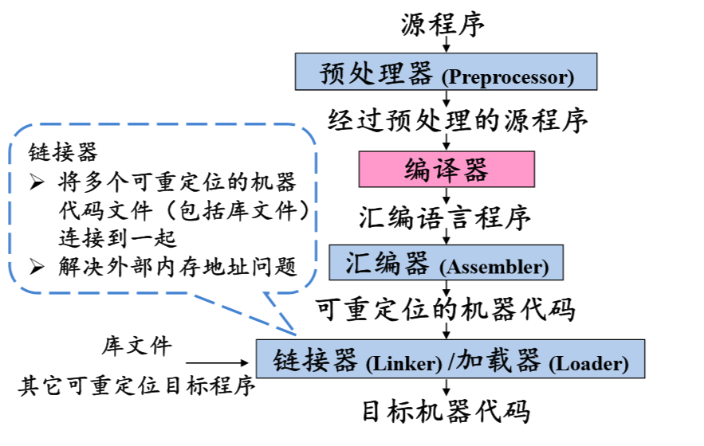
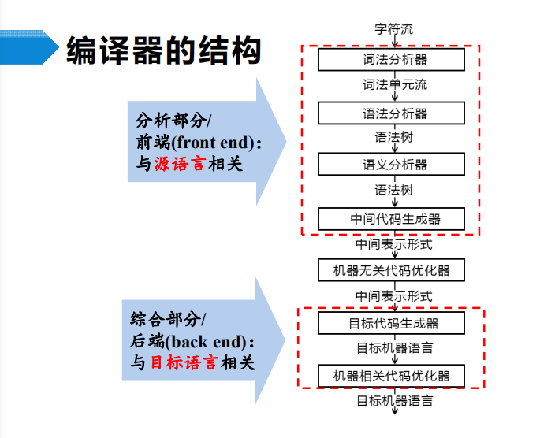
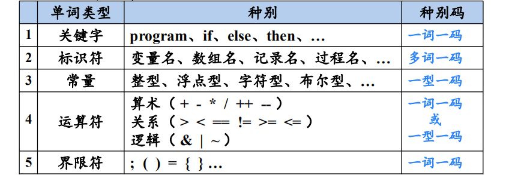
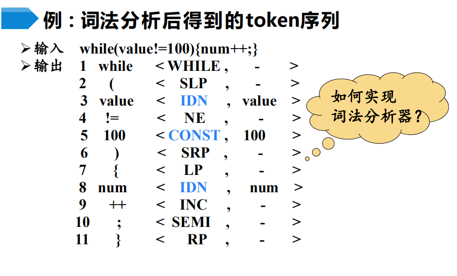
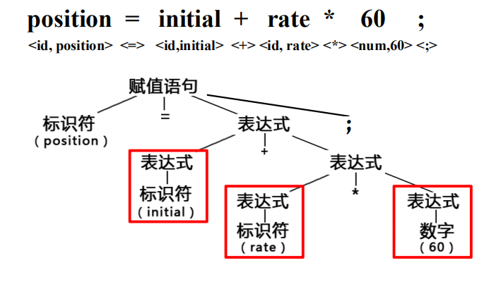
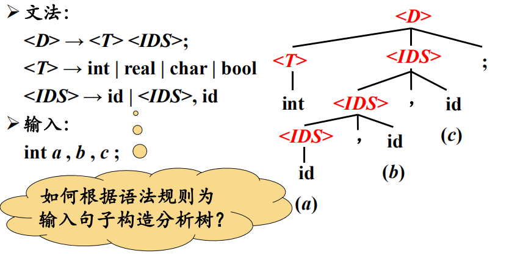
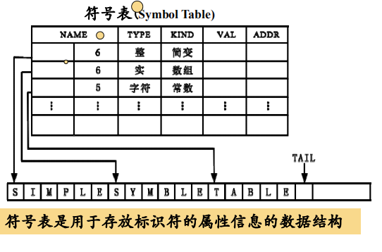
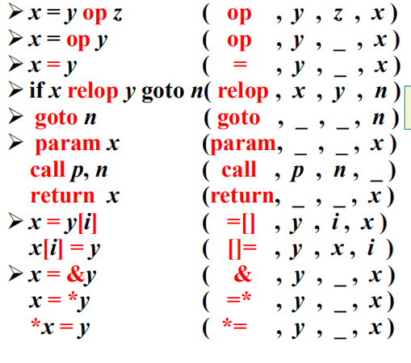
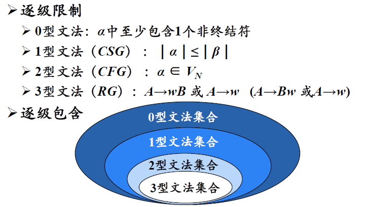

## 编译原理

### 绪论

编译：将<u>高级语言</u>（源语言）翻译成<u>汇编语言或机器语言</u>（目标语言）的过程

#### 什么是编译

+ 预处理器
  - 把存储在不同文件中的源程序**聚合**在一起
  - 把被称为**宏**的缩写语句（如：#define PI 3.14）转换为原始语句
+ 可重定位
  - 在内存中存放的起始位置L不是固定的，代码中的所有地址都是相对于起始位置L的相对地址
  - 绝对地址 = 起始位置 + 相对地址
  - 可重定位，使得代码可以一直到其他机器上
+ 加载器
  - 修改可重定位的地址
  - 将修改后的指令和数据放到内存中适当的位置

#### 编译系统的结构

词法分析（Lexical Analysis）:  确定句子中各个词的词性和词类

语法分析（Syntax Analysis）:  识别句子中的各类短语和结构

语义分析（Semantic Analysis）：通过**分析**源语言，来获得句子**语义**的过程，称为语义分析

#### 词法分析概述

+ 词法分析的主要任务：
  - 从左向右逐行扫描源程序的字符，识别出各个单词，确定**单词的类型**。将识别出的单词转换成统一的**机内表示**——**词法单元(token)**形式
+ token：
  - 由**<种别码, 属性值>**组成
  - 

+ 词法分析实例：
  - 
  - 分析后的格式为**<种别码, 属性值>**
  - 注意与token中的图表进行对照，while这种关键字、!=等运算符、()等运算符都是一词一码，分析后的格式都是**<种别码, ->**，标识符都是完整的**<种别码, 属性值>**

#### 语法分析概述

+ 语法分析器(parser)从词法分析器输出的token序列中**识别出各类短语**，并构造**语法分析树**(parse tree)
+ 语法分析实例
  - 
  - 可以看到，将语法分析树看作一个二叉树，进行中序遍历可还原此表达式
+ 根据变量声明语句构造分析树
  - 
  - <D>:  声明语句（Declaration）;   <T>：类型（Type）;  
  - 注意<IDS>，<IDS>->(id)|(<IDS>,id)；a,b,c分析为<IDS>,c=><IDS>,b,c=>a,b,c，这个分解的过程有点类似递归

#### 语义分析概述

+ 收集标识符的属性信息

  - 种属（Kind）
  - 类型（Type）
  - 存储位置、长度
  - 值
  - 作用域
  - 参数和返回值信息

  > 收集的标识符信息都会存放在一个称为**符号表**的数据结构中

  

  符号表通常会带一个字符串表(表格下面的simple symbol table)，用于存放标识符中的标识符和字符常数等属性信息。

  如name分为两个部分，一个用来存放字符在字符串表中的起始位置，一个用来存放其长度（AST树展开后都会有start和end信息）。

  Q：符号表中为什么要设计字符串表这种数据结构，而不是将标识符直接存放在符号表中？

  A：符号表每一条记录都是**定长**的，而标识符长度无法确定

+ 语义检查

  - 变量或过程**未经声明就使用**
  - 变量或过程名**重复声明**
  - **运算分量**类型不匹配（int类型与float类型相加，结果自动转换为float类型）
  - **操作符**与**操作数**之间的类型不匹配
    * **数组下标**不是整数
    * 对**非数组变量**使用数组访问操作符
    * 对**非过程名**使用过程调用操作符
    * 过程调用的**参数类型或数目**不匹配
    * 函数**返回类型**有误

#### 中间代码生成和编译器后端

常用的中间表示形式：

1. 三地址码（Three-adress Code）	

2. 语法结构树/语法树（Syntax Trees）

三地址码：

- 由**类似于汇编语言**的指令序列组成，每个指令最多有**三个操作数（operand）**

- 指令由**操作码**和**操作数**构成，操作数可能是地址码，也可能是数字、字符等类型

- 三地址指令的表示

  - 四元式（Quadruples）

    

    * 操作符放在第一位，目的数放最后，其他操作数从左到右排放
    * 查看课件1此章节**中间代码生成例子**，生成的四元式结构与汇编语言相似

#### 编译器的结构

+ 目标代码生成以源程序的**中间表示形式**作为输入，并把它映射到**目标语言**
+ 目标代码生成的一个重要任务是为程序中使用的变量**合理分配寄存器**
+ 代码优化
  - 为改进代码所进行的**等价程序变换**，使其**运行得更快**一些、**占用空间更少**一些，或者二者兼顾
  - **机器无关代码优化**在中间代码层面进行，**机器相关代码优化**在目标代码层面优化

### 程序设计语言及其文法

名词规则见[相关名词符号](./相关名词符号.md)文档

+ 0型文法
  - α → β
  - 无限制文法（Unrestricted Grammar）/短语结构文法（Phrase Structure Grammar，PSG）
  - 任意α → β ∈P， α 中至少包含 1 个非终结符
  - 由0型文法G生产的语言L(G)
+ 1型文法
  - α → β
  - 上下文有关文法（Context Sensitive Grammar , CSG）
  - 任意α → β ∈P，|α|≤ |β|
    * 若满足条件，α→ε必定不存在于P，即α不会定义为ε，因此**CSG中不包含空产生式**
  - 产生式的一般形式： α1Aα2→ α1βα2（β≠ε）
+ 2型文法
  - α → β
  - 上下文无关文法（Context Free Grammar, CFG）
  - 任意α → β ∈P，α ∈ VN
  - 产生式的一般形式：A → β
    * 2型文法可看作特殊的1型文法，α1Aα2→ α1βα2，当α1，α2都是ε时，即为2型文法
    * 不要被上下文**有关**和上下文**无关**所迷惑，认为两种文法不是包含与被包含的关系
+ 3型文法
  - α → β
  - 正则文法（Regular Grammar, RG）
  - 右线性（Right Linear）文法：A → wB 或 A → w
  - 左线性（Left Linear）文法：A → Bw 或 A → w
  - 左线性文法和右线性文法都称为正则文法

四种文法之间的关系：

